  

  
  
  

  

<h1 align="center">Hey, I'm Mohammed Hafiz 👋</h1>

  

---

<h3 align="left">👨‍💻 About Me</h3>

  I'm a Flutter Developer from Egypt 🇪🇬, passionate about building polished cross-platform apps and full-stack products.  
  - 🔭 Currently building <strong>Blase</strong> (university portal) & <strong>yallaManwha</strong> (manga reader) 

  - 🏛️ Love <strong>MVVM</strong>, BLoC/Cubit, and GoRouter 
  - 🌱 Always building, always shipping

---

<h3 align="left">🚀 Featured Projects</h3>

<table>
  <tr>
    <td>
      <strong>📱 yallaManwha</strong> 
      Manhwa reader app with a scraper backend, JWT auth & rolling refresh tokens. Features dynamic themes, floating nav, smart caching & multi-language support. 
      <code>Flutter</code> <code>Dart</code> <code>Dio</code> <code>BLoC</code> <code>easy_localization</code> <code>Shorebird OTA</code>
    </td>
    <td>
      <strong>📚 Blase</strong> 
      University portal (mobile) with professor & student views. Clean arch + BLoC. 
      <code>Flutter</code> <code>Dart</code> <code>BLoC</code> <code>GoRouter</code>
    </td>
  </tr>
</table>

---

<h3 align="left">🛠 Languages & Tools</h3>

  

  

---

<h3 align="left">📊 GitHub Stats</h3>

  
  

  

---

